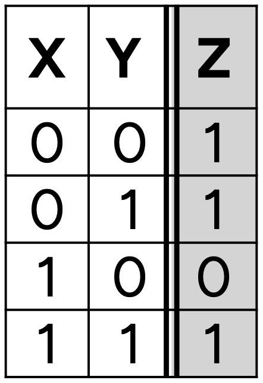
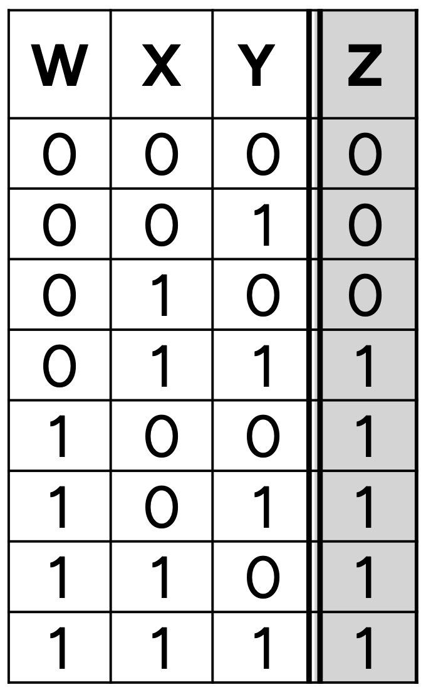
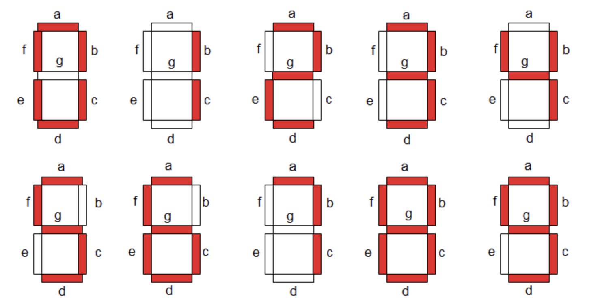
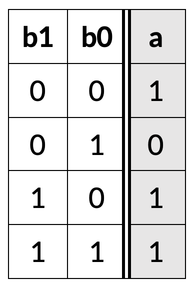
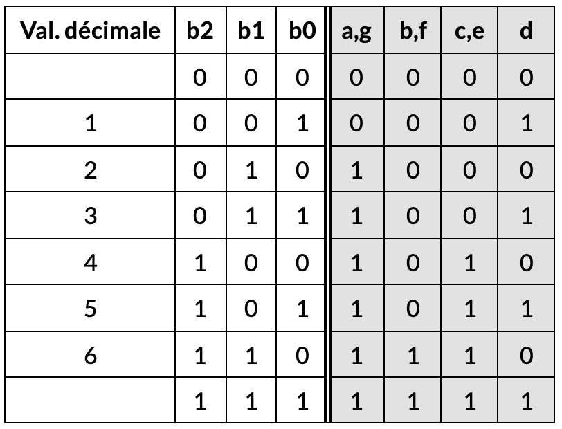
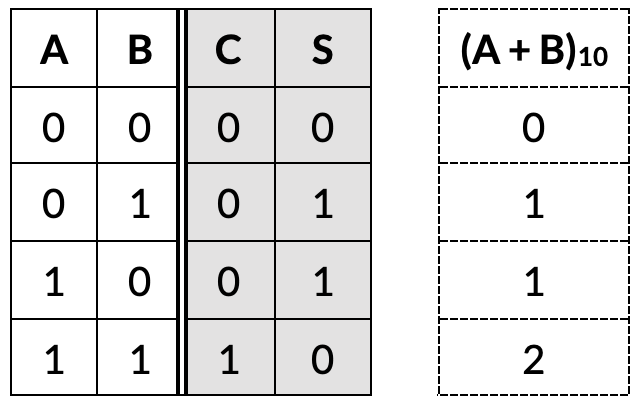
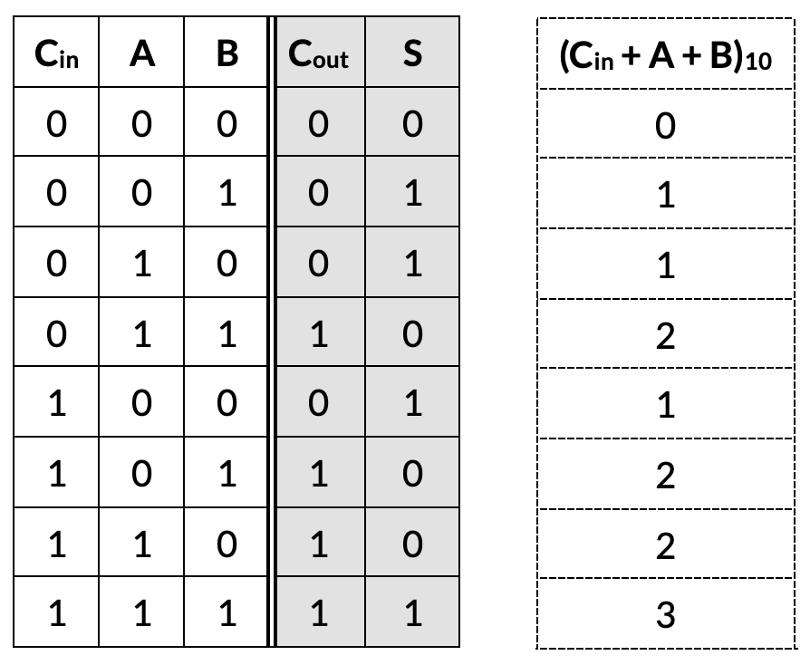
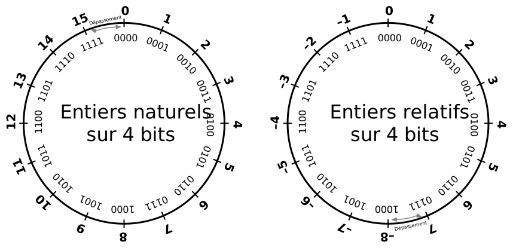

<!-- # 1. Optimisation de circuit

Exercices sur l'optimisation de circuits: je donne une table de vérité, et je veux le circuit correspondant. À faire sur papier.

## Exercice 1.1 

Transformer cette table de vérité en circuit correspondant.

- Utiliser d'abord la méthode systémathique
- Utiliser ensuite la table de Karnaugh et comparer les solutions. -->


# Portes logiques

## 1. De la table de vérité au circuit logique

**1.1** Créer un circuit logique qui implémente la table de vérité suivante :



- Procéder d'abord avec la méthode systhématique vue en classe. 
- Chercher, ensuite, un raccourci : peut-on trouver directement des liens entre la sortie et les entrées ?

**1.2** Créer un circuit logique qui implémente la table de vérité suivante :




- Cette fois-ci, essayez de voir d'abord les relations entre sortie et entrées. Une solution obtenue à travers la <a href="https://logic.modulo-info.ch/?mode=tryout&data=N4NwXAbANAxg9gWwA5wHYFNUBcDOZgCWqADPlgJ5LpgDkRNUKeA2gIwCs7UExAulAQAmYYlFQBDBNRoB1GgF8BqVmUrT6jOCw6iATKz4DhrMZOkANBUt2qqtDUzBtOUAMwAOQ0LC7TU2gCaVnAArlikwBR2NKFYDI7MAOzseq7s-N6uftIAWsEAThFR0nD58VpOEK6p6Uq0iQC0rK4MsWCsACxQAEYEuGCJiqhw4bbSw3GaLLrJ3F6o7e5QbawAnEMjKpFqtBPl04l6xPM+om36G1g229F7U066KW66J7q+566K4qiCRTs030E+ycHWOUE8GQWNF0HQauggrTCPkSPT6eE+UEBW2KtEBwOYoNEOkhtFcrAarhayyRri6vX6GMB1xxAJ++MJUDeJxoHgaoMRWDAHRM9PRXx+rjGuLZ9wJYN0q25HXYfMSAqFS1FYEZPw6UtZQNlHNcPBJNHYuga7A66pcWs+igA7gR8ugWGwuq5+MwZlBEt6ie5vSYXt7fG9g6tOR1g5zaj7ORBvbTwd7hVBVmmlgZvS5WKwA24C1BmKIPIXlYWLWGTK5dGGspSa25MyXfKDYx0kyWTOwvW2oNaG1AOv7ePIgA">méthode systhématique</a> serait très longue à réaliser !

## 2. L'affichage à sept segments

Les affichages à 7 segments permettent d’afficher des chiffres à l’aide de 7 diodes lumineuses (LED).




- Ajoutez les entrées et les lampes qui manquent pour compléter cet affichage à 7 segments.
- Tournez la barre avec _click droit > Affichage > Barre verticale_.
- Ajoutez les entrées et ajoutez les étiquettes a-g. Pour ajouter une étiquette: _click droit > set_name_.
- Affichez un nombre entre 0 et 9.

<iframe style="width: 150%; height: 500px; border: 0" src="https://logic.modulo-info.ch/?mode=full&showonly=in,bar,/?mode&data=N4NwXAbANA9gDgFwM5mAXygYxgWzjAOwFMDlUBLAgBlQQE84iwByS5qfFAbQiqgFYqAXSjkAJmD4EAhjibNp7ENIA2YAIwZK62g3lsOMbrygBOYaIkBmKDLksARswwPpAJxrB6jR+-acwLgAmdT5BEXENW1l5RSgxciQ4FWk6FgALZyhXNx0vPV83fyNAoIAOPnUgi0ig6PtmJ3jE5NSWECycoN0fRr9DbnK+IN4IiQAWevlMdgSklLTmDpd3Kx75HOLB0Kh1czGwfmb5tuZMtAwAd3I3Im4uSpEuGyChITQgA"></iframe>


### Affichage à 2 chiffres
Les 7 diodes lumineuses (LED) permettent d’afficher les chiffres de 0 à 9. L’état des lampes (a-g) ainsi que du point décimal est déterminé par 8 bits.

- Ajoutez un deuxième bloc affichage à 7 segments
- Ajoutez une entrée octet
- Connectez les deux automatiquement en alignant les broches
- Configurez les entrées pour afficher le nombre 42

<iframe style="width: 150%; height: 250px; border: 0" src="https://logic.modulo-info.ch/?mode=full&showonly=7seg,in.byte,/?mode&data=N4NwXAbANA9gDgFwM5mAXygYxgWzjAOwFMDlUBLAgBlQQE84iwByS5qfFAbQiqgHYqAXSjkAJiwCMAJgC0kgJzsARuTIAOKCACGAGxZVJkqoePMMzfkiIBzKs1oMml6zfacwXSbwHDRE5ipZfnMMAHdyACcibi9pKD8vAGYoSREvABYoaXTJAFYoJNzoDNz+KDzczQhchQEhITQgA"></iframe>


### Afficher 0 et 1
La porte NON inverse un signal.

- Ajoutez les connexions pour afficher 0 ou 1 selon le signal sur l’entrée b0.
- Ensuite, convertissez l'input en horloge, pour alterner 0 et 1 chaque seconde: _click droit > Remplacer par horloge_

<iframe style="width: 150%; height: 400px; border: 0" src="https://logic.modulo-info.ch/?mode=full&showonly=in,not,7seg&data=N4NwXAbANA9gDgFwM5mAXygYxgWzjAOwFMDlUBLAgBlQQE84iwByS5qfFAbQHYqoAjAFYqAXSjkAJmAH8CAQxxNmAC3IBzFexDyANjIlIAwoSQJ5pMAgBOAVyIZmPJEXVVmtBsuev2nMFwALHyCABxiEtLMVAC0PMwYBDAINMD0jCxJCH4w3ALhUIERlDIATLC2CDIAzBiUAp4ZrAQ53CFF4lIyAmgYAO7k1kTcXLKC4qMCgqUTAtVQYqJoQA"></iframe>

### Décoder 0 à 3
Le tableau ci-dessous montre les segments à allumer pour afficher les nombres 0 à 3 d’un affichage à 7 segments.


Ajoutez des portes NON, OR, et AND pour compléter le circuit

Astuce - Essayez de trouver le circuit logique pour chaque colonne. C’est-à-dire il faut trouver le circuit pour allumer le segment. Par exemple pour le segment a vous avez la table de vérité suivante.



Certaines colonnes sont identiques, donc vous pouvez utiliser le même signal.

<iframe style="width: 150%; height: 470px; border: 0" src="https://logic.modulo-info.ch/?mode=full&showonly=in,not,and,or,7seg&data=N4NwXAbANA9gDgFwM5mAXygYxgWzjAOwFMDlUBLAgBlQQE84iwByS5qfFAbQHYqoALFQC6UcgBMwADigEAhjibMARlWYZKARloMlbDjG58oAThFjJJ2QqXLN6sQQBMOxi32cwvfpoCs5iTBNfnlFFgALcgBzcPYQOQAbILEkAGFCJAQ5UjAEACcAVyIMZh4kIii1VyUyivZPLgFjTSkAyWYqAFoeBwIYBBpgejdmPoR6wy8W-iFRSiCnWAKEIIBmDGzxQeGlTYnuJ38oJ1WAgimBKD9RGGWgiAwYPO3dFif9r1XgqH85865NDwrlIbndNCY0BgAO7kPJEbhcKwQUQAnwomSaJwozSrQTY3GAlFWFrYqwiYRoIA"></iframe>

### Extension facultative

Créer le circuit qui permet d'afficher les chiffres de 0 à 7. 
- Combien de bits faut-il ?
- Reécrire la table de vérité pour les chiffres de 0 à 7 ;
- <a href="https://logic.modulo-info.ch/?mode=full&showonly=in,not,and,or,7seg&data=N4NwXAbANA9gDgFwM5mAXygYxgWzjAOwFMDlUBLAgBlQQE84iwByS5qfFAbQHYqoALFQC6UcgBMwADigEAhjibMARlWYZKARloMlbDjG58oAThFjJJ2QqXLN6qMx5IiAczU7GLZ2-acwXBCaAKxQmkKiEixUALQ8DpQAzJ56BH6GAcbh5lGamtaKLMoATOpoaEA">Rajouter les portes manquantes</a>.


## 3. Le dé

Un dé de jeu peut afficher les nombres 1 à 6 à l’aide de 7 lampes.
Plusieurs lampes s’allument par paire. Voici la table de vérité.




Utilisez des portes logiques OR et AND pour créer le circuit qui allume les lampes correspondantes aux nombres 1 à 6. Le nombre binaire **b<sub>2</sub>b<sub>1</sub>b<sub>0</sub>** doit allumer les lampes a-g pour afficher ce nombre dans la façon d’un dé à jeu standard.

<iframe style="width: 150%; height: 350px; border: 0" src="https://logic.modulo-info.ch/?mode=full&showonly=in,bar,and,or&data=N4NwXAbANA9gDgFwM5mHATvAhgcywgSxgDsARAUwBssBPMARgAYBfKAYxgFs4TzjlUBYo1QIaccmADkQqVB4oA2hEZQALIwC6UAgBMwAdijEsnSVIBGjOSCyUGrIfVHjzs+TCUqoADi079H2NTcwt6KUdiACYXCWl3BTBlVXoo-z0wKOgTM2kLKJs7BygLLHQRYDE4yzK5RMUAZj8oBvT9VRzzLDldAiQ4ajopOAAPCJKy50rXPNqPJSbVAzaGYNzLHr6B2mlR8dL0GOnqg7rPJLVWqGXtGHQCPgRpJDkMqLXzXU3+wd2x1gODVioTm9UWUFSKwaH2kbG+2yGewBZTUwNm6DOSjUzRuATAahhUgAZvDfsN-hN0ABWNE1DHzC7NVraDJUwnkUk7cn7MoQWmnBmKbEpNIs-TZELSHCcxH-ZjMIA"></iframe>


##  4. Multiples commutateurs
La porte XOR permet d’allumer et éteindre une lampe avec des commutateurs multiples.

Dans le schéma ci-dessous, on peut allumer la lumière dans une pièce à partir de la porte d’entrée et de la cuisine.

Ajoutez un circuit pour qu’on puisse également l’allumer depuis la chambre.

<iframe style="width: 150%; height: 383px; border: 0" src="https://logic.modulo-info.ch/?mode=full&showonly=in,out,not,or,and,xor,group&data=N4NwXAbANA9gDgFwM5mAXygYxgWzjAOwFMDlUAnIzBABlQQE84iwByS61qfFAbQCYAnDSgBGfjQC6UAO5gAzDREALMBJHYANjHJsGRTdplckCcjADWRAOoBLACYJV-DLYJ1gjZmzdceYXlElMQBWKSgHMEEoAgBDHBZWEjMAS6JWVwJReiZE324YPiERfjDpHVtktgIuSNEAFhj4xMxleIAjSgyIgn4c71Z8-156gHYRcXCKqtZjCPswURCmhLZMAFdbJDd0jHbY8g8vRP3yP0KAxRF68LqNGG1dVn1DGDn7LbhNWIY2OAAPbr-HRHXJsYFnApFCRQYTlciVUjVWoEAKiURifjldYIRbyNAYGS2Sh8QLyMThXjRdHSQLLcSSSRoIA"></iframe>


### Porte XOR avec plusieurs entrées

- Créez une porte XOR avec 3 entrées et observez son comportement.
- Créez maintenant une porte XOR avec 4 entrées et observez son comportement.


<iframe style="width: 150%; height: 300px; border: 0" src="https://logic.modulo-info.ch/?mode=full&showonly=in,out,xor&data=N4NwXAbANAxg9gWwA5wHYFNUBcDOZgCWqATPlgJ5LpgDkRNUKeA2gKytQQAMAulAQBMwARggBffqgDMZStTqoGTMGw7CuvfkOEB2CUQAssqrXqM4LdlGEHNgkQA4JcAK5Zhx+a6xKLK4gCcahp89sIB+qhcnqaK5ixSQVDsoUJckR7AFCYKvglJQakikawxufEqiWpSrEXEkRBlZsrMVdY6tVpgUhIANgCGAEbovZnZ8gPDvXkquhxSmljoAB5YtCgATksABAAaAPIAStv9IOgw21LbmFgbAJfoODR9QyPRWXK0kyMzbDVQCz4S1W6zgW3QeyOJzOFwM12w90ezzEYiAA"></iframe>

Comment se comporte une porte XOR avec plus que 2 entrées ? Qu'observez-vous ?

<!-- ## 10.6. Addition binaire
Nous avons maintenant tous les éléments pour construire un additionneur binaire. Rappelons-nous que l’addition binaire est très simple.



Le résultat A+B peut être 0, 1 ou 2. Nous avons besoin de deux bits pour représenter le résultat :
- le bit de somme S
- le bit de retenue C (_carry_ en anglais)

En regardant la table de vérité, on constate que :

- la somme S est exprimée par la fonction XOR
- la retenue C est exprimée par la fonction AND

Vous trouvez le circuit ci-dessous à droite. Vérifiez sa fonction en cliquant sur ses entrées, pour les 4 combinaisons 00, 01, 10, 11.

<iframe style="width: 150%; height: 430px; border: 0" src="https://logic.modulo-info.ch/?mode=full&showonly=in,out,and,xor,halfadder&data=N4NwXAbANA9gDgFwM5mAXygYxgWzjAOwFMDlUBLAgBlQQE84iwByS5qfFAbQGYB2KlABMAgLpRyAEzCCCAQxxNmAQWYZKARloMlbDjG79BPIVXFSwGqPMUsAQmokEh2xiz2cwXAKyCIZiWkNAA5rBSVVdQIeV10Cdk8fQQ0qAIsNAE4w22YHDBgAVwQaYHo3ZkKEBIMvb19hYLTpUJslAGVHTFiWSuruOuMAFiawLNaWAGFHSq1SnR6ivq9MvxHTbPaAAgAKJFxFAEppopc58t79bhWoFLWrceYJnYAnIgQSAqIjjAAPGGeSmUlH9nksuINGg00gQvEIoDxxJUwIMMHICJJAfNmGjJGCIUNobUoBBEUUwHwMAALOSSSREAHdZjUgA2ADMaXTQZdlutGuYYVwUjcNKSEDybgiMMy5AAjIjMzHlaVy5lg27CALvH5i5gIWXMoibOmbEAAS+e5AQprUGAA7uRXtwuIIhOJnVBvG6rAioILiW7BlBgm6+FAMl7QikvVkNCLfRo4aYvTxhCLRGggA"></iframe>


## Additionneur complet

L’additionneur de 2 bits de la section précédente n’est plus suffisant. Pour le cas général, nous avons besoin d’un additionneur qui additionne 3 bits. Il faut tenir compte de la retenue (C<sub>in</sub>), qu’il faut inclure dans l’addition. Voici donc la table de vérité pour un additionneur complet.




Regardez les colonnes et essayez de comprendre avec quelles portes on pourrait le construire. Vous constatez que la colonne S représente la parité. On pourra donc la construire avec des portes XOR.

Ajoutez les deux fils qui manquent à l’entrée de la porte ET pour que le circuit produise le signal C<sub>out</sub> et se comporte comme un additionneur complet.

Ajoutez des entrées et sorties au bloc de l’additionneur complet et vérifiez son fonctionnement.

<iframe style="width: 150%; height: 452px; border: 0" src="https://logic.modulo-info.ch/?mode=full&showonly=in,out,and,xor,adder&data=N4NwXAbANA9gDgFwM5mAXygYxgWzjAOwFMDlUBLAgBlQQE84iwByS5qfFAbQHYqoALFQC6UcgBMw-AgEMcTZgEFmGSgEZaDBWw4xufKAE4RYyWqiz5LAEIqxBAEybGLHZzC9+aoaIlgHFnIKAMJsGDAArgg0wPQuzJEI7O5cAg78ECZ+PIFWzADKdokasVosicl6HmleAMxZkg7QliEVGDIE4jFxCh3ildwOBmrpvgQeABxGoolgalTtnSU9LH0DHg7pUGp8Yx7e2wCsM1FzEBgAHjAATt1lzFfX61w7-IdZ4y85ahMnCHOGS43Zb3R7PBzGKCZPZcLYONR-fwOcK3ZwKG7PWrvbb1GEOWpQBwCREOQ7tcTiIio0rxGQUqnPbz8WrzGbXcgkf7MAjsSgsIYAWgh7FmXHqUBZwjQGAA7uRrkRuFwvDxRC9tr8oC9DISTLDCQitZsoKqtWodZqXvx8Wq1NAiWrSYSII7plKgA"></iframe>


## Additionneur 4 bits
Pour additionner deux nombres 4-bits (quartets) nous avons besoin de 4 additionneurs complets. Chaque sortie C<sub>out</sub> est liée à la l’entrée C<sub>in</sub> de l’additionneur suivant.

Pour additionner **a** et **b** vous devez additionner les bits correspondants: a0+b0, a1+b1, etc.

- Ajoutez les circuits manquants pour additionner deux nombres 4-bits.
- Montrez l’addition de 7+5 dont le résultat devrait être 12.


<iframe style="width: 150%; height: 485px; border: 0" src="https://logic.modulo-info.ch/?mode=full&showonly=adder&data=N4NwXAbANA9gDgFwM5mAXygYxgWzjAOwFMDlUBLAgBlQQE84iwByS5qfFAbQFYqoAjBCoBdKOQAmLAMwB2ALQAWKuwIBDHE2YAjdtvJlFUEGoA2LKgMvMMlAbQZa2HGNz5QATAE5R4qc1lFeVlZVQ0tNT0DFCMTc2ZLKxsoCXIkOBpgekYWVPTTNTp2TjAuRWl+AQAOX0kWRQElRTDNFiRkvLh7LMdctLgCopduAVlK4TE65h5peR4IDv6PBxzmTsHi11LR-m9a-1kq+SqBZLUJCSIAJ0zsiIvrze5pD0qxsRgr8hIEFgJ2SgsDw8eQeUKwACuvy4Hiqni8Igw50uV26dxYyMew1KL3471gXx+fwBBBkVHkL3YMChOOkUGkikRGAA7uQrkRuFwGZ5ZGIubJ6QI+dI4R4IMK6Q0+bCoIoPMKBTNhXCeIyoFyvFAeDw+coteL1YEoIc+bIeMaEYboDVTQKTqajBVTebgSJEUA"></iframe>


## Incrémenter i

Additionner 1 à un nombre binaire est une opération très fréquente. Elle est utilisée pour incrémenter le compteur de programme `pc` (program counter), pour pointer à la prochaine instruction.

Complétez le circuit pour incrémenter la variable `i`. Dans beaucoup de langages de programmation, une variable incrémentée est désignée par `i++`.
En Python nous écrivons `i = i + 1`.

D’ailleurs le nom du langage de programmation C++ est une référence à cet opérateur d’incrémentation.

<iframe style="width: 150%; height: 420px; border: 0" src="https://logic.modulo-info.ch/?mode=full&showonly=in,out,in.nibble,out.nibble-display,adder&data=N4NwXAbANA9gDgFwM5mAXygYxgWzjAOwFMDlUBLAgBlQQE84iwByS5qfFAbQFYqoA7FQC6UcgBMWVALQBmdgCNyZACxQQAQwA2LAIz6qzDOPJI4NYPUYsTZrRrrtOYLipX8hoiSxXSB7Ag0cJlYjKFs4XVoGEIj7Rw4Ybjd+WSoRMUlmHghpHgBOAKCQ8gBqUrCNcXEiACcLKxCqmtqnJJdZfP5dLq8CFgAmHmkB-1gAVwQXAYAOKAH84QxmuqjLGJYV1sTuHu7esX7mWWHZMZhJjrnOpagtgejrZi227i6oPb6fAek3dgupq4eFAVBBbltZI8mtU6q9pu9PocfAJfoUJoC+FAeLolhgAO7kWpEbhcfgqURcXRYikDKBgqBcWSCCmdEHkhkLEGLBnYqBnYRLIA"></iframe>


## Décrementer i

Soustraire 1 à un nombre binaire est une opération très fréquente. Elle est utilisée pour décrémenter un compteur de boucle `i`, un pointeur de pile `sp` (stack pointer), ou un pointeur `p` vers les adresses de la mémoire.

Complétez le circuit pour décrémenter la variable `i`. Dans beaucoup de langages de programmation, une variable incrémentée est désignée par `i--`.
En Python nous écrivons `i = i - 1`.

Astuce : pour décrémenter la valeur `i` il suffit d’additionner 1111 qui représente la valeur -1 en format signé.

<iframe style="width: 150%; height: 460px; border: 0" src="https://logic.modulo-info.ch/?mode=full&showonly=in,out,in.nibble,out.nibble-display,adder&data=N4NwXAbANA9gDgFwM5mAXygYxgWzjAOwFMDlUBLAgBlQQE84iwByS5qfFAbQFYqoA7FQC6UcgBMWVALQBmdgCNyZACxQQAQwA2LAIz6qzDOPJI4NYPUYsTZrRrrtOYLipX8hoiSxXSB7Ag0cJlYjKFs4XVoGEIj7Rw4Ybjd+WT4vSWYeCGkeAE4AoJDyaWkwjXFxIgAnCysQiqrqpySXWTz+ACZ3LwIWTp5pTv9YAFcEF06ADihOvOEMRpqoyxiWJebE7l0O2Z6xPuY0uRGYcbaZ9oWoDc7o62YNlu5d7pEDn07pN3YzidceFAVBBrhtZPcGpUas9Jq99pQfAJvgUxv8+FAeLoFhgAO7kapEbhcfgqURcXQYsmdKAgqBcWSCMntIGkulzIHzOmYqCyATCBZAA"></iframe>


## Changer de signe (-i)

Les nombres signés sont représentés avec le format complément à deux. Pour un nombre 4-bits, ceci nous donne une plage de -8 à +7 pour des entiers relatifs, et une plage de 0 à 15 pour des entiers naturels. Nous constatons que la plage signée n’est pas symétrique: le côté négatif compte un nombre en plus.




L’opération pour trouver le nombre négatif est: inverser tous les bits (symbolisé par `~`) et additionner 1.
Mathématiquement nous pouvons exprimer cette opération comme:

```
-i = ~i + 1
```

Par exemple, pour obtenir la représentation binaire de -1 nous inversons 0001, ce qui donne 1110 et nous additionnons 1, ce qui donne 1111.

Complétez le circuit pour inverser le signe de la variable `i` et obtenir son négatif `-i`.

<iframe style="width: 150%; height: 480px; border: 0" src="https://logic.modulo-info.ch/?mode=full&showonly=in,out,not,in.nibble,out.nibble-display,adder&data=N4NwXAbANA9gDgFwM5mAXygYxgWzjAOwFMDlUBLAgBlQQE84iwByS5qfFAbQFYqoA7FQC6UcgBMWVALQBmdgCNyZACxQQAQwA2LAIz6qzDOPJI4NYPUYsTZrRrrtOYLipX8hoiSxXSB7Ag0cJlZ2ACcNEwAPMGldKmNTOF1aBhDbOHtHDhhuFQh+WU8xSWYeCGkeAE4AoJDpcnDI8hi4hKgCGAQLKxDOhCdclyr+XQAOEVgw8hIEFiR2SkhdWABXOYgAJgxI8SIwnrSWXf3BvPioTYKvAhZNnmlN-zW5rk2xy6rhHfE9sJTLEdmCcwmcXJsLldJktmLIHkV2DB1i5ZB9ZF8fn9NqlrMDfqcctwDJdrmJbswVJtpG5EcjXDwoPlvlAQbIcSEQWCuLJIaSYSoBNSai8XHwoDxdN8MAB3chhIjcLj8FSiLgrHiqzZQCCq2SCXVVRkqqBvQ0qL4miVQIqqraMza67WSk0qBnVYTfIA"></iframe>

## Soustraction (a-b)

Pour soustraire deux nombres `a-b` il suffit d’additionner le nombre négatif du deuxième (`-b`). Ce nombre négatif peut être obtenu en inversant tous les bits et additionner 1.
Donc `-b = ~b + 1`.

Complétez le circuit pour soustraire `a-b`. Le résultat de 10-3 devrait être 7.

<iframe style="width: 150%; height: 550px; border: 0" src="https://logic.modulo-info.ch/?mode=full&showonly=in,out,not,in.nibble,out.nibble-display,adder&data=N4NwXAbANA9gDgFwM5mAXygYxgWzjAOwFMDlUBLAgBlQQE84iwByS5qfFAbQBYqoAjFSoBdKOQAmLKgFoAzOwBG5MjyggAhgBsWQocwyUBtBk1YF2nML34AmIWMksIcmRAhKVKNZp3NhAgIGUBLkSHA0wPSMLKHhWhp0ljDcgfxCouJSzDwyAOzsBBo4ZhrBcXDGUaaxYXAJSRwp1jx8gnyO2QCsEDJdAJyFxaUyiuV1tiYxzBUNyalCUPaZTsx5vXmDUEUlLGMYBDAIkdFmhwjz1rZd-P0rBGAAHNAwAK4IT3kYGhISRABOJxqzB+f3+ly4cjk6QcsH+5BIH2YFnED2Y1xktgKsHeV0eS36Im+vwBVVOLFBAIhUP40MyMHhiJYKMoLDkXXk2LeH0h+LkhOJYMm1WmlPBTW4NKgfHpjNIzPYrJythkrXY3JaXWlECJUDFcimpRJ4qskOhS1hDIR8uRirRPDyqq2Gq4NygXQERIwAHdyP8iNwuPweGIuAJ3aHbFAdVBIVA8qH+dKQ7HbP1pYTYx6oHIE6n8T1Q3YuqGXPGY1wIGo8nnK1q8o9S9BNqHHnklhWy88RESgA"></iframe> -->

# Exercice optionnel

## Le feu de circulation

Créer d'abord une lampe clignotante, en transformant l'input en horloge (_click droit > Remplacer par horloge_)

<iframe style="width: 150%; height: 220px; border: 0" src="https://logic.modulo-info.ch/?mode=full&showonly=in,bar&data=N4NwXAbANA9gDgFwM5mAXygYxgWzjAOwFMDlUAjAQwCcAGVBATziLAHIrq2p8UBtAEwAOWlBEBdKAEsAJmACMWGABsY1dtSIzuMqUjjLKjdgAUAGmwxSC9YExbtr3XmD4ixtSbLABmNBgB3KU1+Ph8oeXFxNCA"></iframe>

Construire maintenant un feu de circulation. Le feu doit changer de couleur à chaque cycle d'horologe : vert, jaune, rouge, vert, jaune, rouge...

- Insérer les deux lampes qui manquent. Avec un click droit vous pouvez en modifier la forme et la couleur.
- De combien de bits aurait-on besoin pour représenter ces trois états ?

<iframe style="width: 150%; height: 490px; border: 0" src="https://logic.modulo-info.ch/?mode=full&showonly=in,bar,not,and,or,clock,counter&data=N4NwXAbANA9gDgFwM5mAXygYxgWzjAOwFMDlVMAbGTAawAZUEBPOIsAckupvanxQDaARjoBWKAA5RAXSgBLACZghfIgCc5MJQCY6ejACMAhmobBmrDsbW9+YAaMeSZ8nVhhU1HNUQW8FckhwFEZMHAAKABrsGNgArqTqZhZsnDAJCOq2MILaAOziInSycgT2AMxQACyy6QgcogC0AJwxaGhAA"></iframe>

**Astuce** : on ne peut pas utiliser un seul horologe, et créer un circuit qui arrive à distinguer trois états. Il nous faut de la mémoire. Ici, un composant très commun qui s'appelle compteur. Essayez de connecter l'horologe au bon endroit, et explorez les sorties pour créer le circuit correspondant au feu de circulation.

- Êtes-vous capable de trouver une solution pour que le feu passe directement de rouge à vert, sans l'étape intermédiaire où il est éteint ?

<a href="https://logic.modulo-info.ch/?mode=full&showonly=in,bar,not,and,or,clock,counter&data=N4NwXAbANA9gDgFwM5mAXygYxgWzjAOwFMDlVMAbGTAawAZUEBPOIsAckupvanxQDaARjoBWKAA5RAXSgBLACZghfIgCc5MJQCY6ejACMAhmobBmrDsbW9+YARADM4iXVmKw2rDCpqOaogVeBTkkOAojJg4ABQANdkMTIUYWNnZrWxhBJ3EhKXclEW9fDiYiCioAd2DQ8MiY+MS1bRTLdJNM7OcobQBON3lClRCwiKj2OITvAFdSdTMLNOxZhHVO+21u3pl5AnshLyFHWRhphA4hABYAWiEIXgM5Mi9l0k8MAhgEBdSOT4R1gJnLlHAM5HshAB2WBnZQSDBGAgKH5tRFBPhZeyibQuMF7YS9HoDU7nbRCBFI5LmX7sNGA7G5fK7DZeTYnWHaS4UhQtamopH0nE9frufFC7QQdmkyHcxytNJ0jGCRyXcTaSE7cEbCTCqVgUEfL5UxZ-L6AxwQXIi5mOFQk-XaNAYSpyAKCYRQA6yARknrezmegY+6FCITeq6eyHh8S272OVmSqDCHU4uOs45JiPaLygORGexAiB0KCQtzSNDRonhnVCXqV7Q63P5gQ+qQ9UFQdhIdjScvhy7CqBNgvqtW6Tvd3sVpMdo5DkB5kdtlXidjVKdToA">Solution</a>.

# Sources

Cette page a été contruite à partir de https://apprendre.modulo-info.ch/.