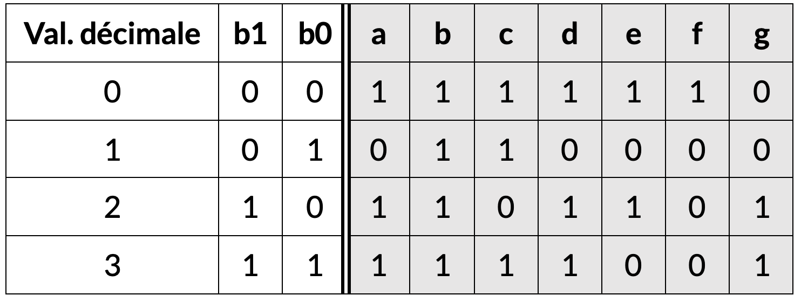

<!-- # 1. Optimisation de circuit

Exercices sur l'optimisation de circuits: je donne une table de vérité, et je veux le circuit correspondant. À faire sur papier.

## Exercice 1.1 

Transformer cette table de vérité en circuit correspondant.

- Utiliser d'abord la méthode systémathique
- Utiliser ensuite la table de Karnaugh et comparer les solutions. -->

!!! En vrai, je dois penser au test et faire en sorte de vérifier qu'ils aient tous fait ce que veux demander. Tout le reste est un plus. 

Ceci dit, j'aimerais bien mettre un problème comme les sept segments au test.

# 2. Portes logiques: applications

Nous commençons ce TP par étudier des applications des portes logiques.

## 2.2 - L'affichage à sept segments

Les affichages à 7 segments permettent d’afficher des chiffres à l’aide de 7 diodes lumineuses (LED).

- Ajoutez les entrées et les lampes qui manquent pour compléter cet affichage à 7 segments.
- Tournez la barre avec _click droit > display > vertical bar_.
- Ajoutez les entrées et ajoutez les étiquettes a-g. Pour ajouter une étiquette: _click droit > set_name_.
- Affichez un nombre entre 0 et 9.

<iframe style="width: 120%; height: 500px; border: 0" src="https://logic.modulo-info.ch/?mode=full&showonly=in,bar,/?mode&data=N4NwXAbANA9gDgFwM5mAXygYxgWzjAOwFMDlUBLAgBlQQE84iwByS5qfFAbQiqgFYqAXSjkAJmD4EAhjibNp7ENIA2YAIwZK62g3lsOMbrygBOYaIkBmKDLksARswwPpAJxrB6jR+-acwLgAmdT5BEXENW1l5RSgxciQ4FWk6FgALZyhXNx0vPV83fyNAoIAOPnUgi0ig6PtmJ3jE5NSWECycoN0fRr9DbnK+IN4IiQAWevlMdgSklLTmDpd3Kx75HOLB0Kh1czGwfmb5tuZMtAwAd3I3Im4uSpEuGyChITQgA"></iframe>

### Affichage à 2 chiffres
Les 7 diodes lumineuses (LED) permettent d’afficher les chiffres de 0 à 9. L’état des lampes (a-g) ainsi que du point décimal est déterminé par 8 bits.

- Ajoutez un deuxième bloc affichage à 7 segments
- Ajoutez une entrée octet
- Connectez les deux automatiquement en alignant les broches
- Configurez les entrées pour afficher le nombre 42

<iframe style="width: 120%; height: 250px; border: 0" src="https://logic.modulo-info.ch/?mode=full&showonly=7seg,in.byte,/?mode&data=N4NwXAbANA9gDgFwM5mAXygYxgWzjAOwFMDlUBLAgBlQQE84iwByS5qfFAbQiqgHYqAXSjkAJiwCMAJgC0kgJzsARuTIAOKCACGAGxZVJkqoePMMzfkiIBzKs1oMml6zfacwXSbwHDRE5ipZfnMMAHdyACcibi9pKD8vAGYoSREvABYoaXTJAFYoJNzoDNz+KDzczQhchQEhITQgA"></iframe>

### Afficher 0 et 1
La porte NON inverse un signal.

- Ajoutez les connexions pour afficher 0 ou 1 selon le signal sur l’entrée b0.
- Ensuite, convertissez l'input en horologe, pour alterner 0 et 1 chaque seconde: _click droit > changer en horologe_

<iframe style="width: 120%; height: 400px; border: 0" src="https://logic.modulo-info.ch/?mode=full&showonly=in,not,7seg&data=N4NwXAbANA9gDgFwM5mAXygYxgWzjAOwFMDlUBLAgBlQQE84iwByS5qfFAbQHYqoAjAFYqAXSjkAJmAH8CAQxxNmAC3IBzFexDyANjIlIAwoSQJ5pMAgBOAVyIZmPJEXVVmtBsuev2nMFwALHyCABxiEtLMVAC0PMwYBDAINMD0jCxJCH4w3ALhUIERlDIATLC2CDIAzBiUAp4ZrAQ53CFF4lIyAmgYAO7k1kTcXLKC4qMCgqUTAtVQYqJoQA"></iframe>

### Décoder 0 à 3
Le tableau ci-dessous montre les segments à allumer pour afficher les nombres 0 à 3 d’un affichage à 7 segments.

Ajoutez des portes NON, OR, et AND pour compléter le circuit

Astuce - Essayez de trouver le circuit logique pour chaque colonne. C’est-à-dire il faut trouver le circuit pour allumer le segment. Par exemple pour le segment a vous avez la table de vérité suivante.

Certaines colonnes sont identiques, donc vous pouvez utiliser le même signal.

<iframe style="width: 120%; height: 470px; border: 0" src="https://logic.modulo-info.ch/?mode=full&showonly=in,not,and,or,7seg&data=N4NwXAbANA9gDgFwM5mAXygYxgWzjAOwFMDlUBLAgBlQQE84iwByS5qfFAbQHYqoALFQC6UcgBMwADigEAhjibMARlWYZKARloMlbDjG58oAThFjJJ2QqXLN6sQQBMOxi32cwvfpoCs5iTBNfnlFFgALcgBzcPYQOQAbILEkAGFCJAQ5UjAEACcAVyIMZh4kIii1VyUyivZPLgFjTSkAyWYqAFoeBwIYBBpgejdmPoR6wy8W-iFRSiCnWAKEIIBmDGzxQeGlTYnuJ38oJ1WAgimBKD9RGGWgiAwYPO3dFif9r1XgqH85865NDwrlIbndNCY0BgAO7kPJEbhcKwQUQAnwomSaJwozSrQTY3GAlFWFrYqwiYRoIA"></iframe>

### Extension facultative

Créer la logique pour tous les chiffres de 0 à 9. 

## 2.3 Le dé

Exercice du dé, tel quel (pas si dur donc ptet changer l'ordre?)

## 2.1 - Le feu de circulation

D'abord lampe clignotante

Construire un feu de circulation. Nous avons un signal d'horologe (_clock_). Mais pas sûre que ce soit facile (je dois essayer d'abord).

ça se fait que avec de la mémoire. Alors super cool, je le mets en dernier 

# 3. Additionneur

## 3.1 Table de vérité

Reconstruire la tdv de l'additionneur.

Ensuite, Karnaugh pour trouver le circuit. --> NON !! Voir si j'arrive à les guider, sinon tant pis

## 3.2 Multiple commutateur

Exercice de la porte XOR avec la lampe de la chambre (10.5 Modulo)

10.8 Addition à 4 bits

aussi l'exo où l'additionneur ne marche pas

10.9 Incrémenter i

10.10 Décrementer i

10.12 Soustraction

S'ils arrivent ici, ils sont des dragons.